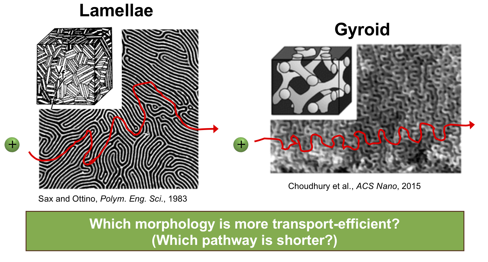
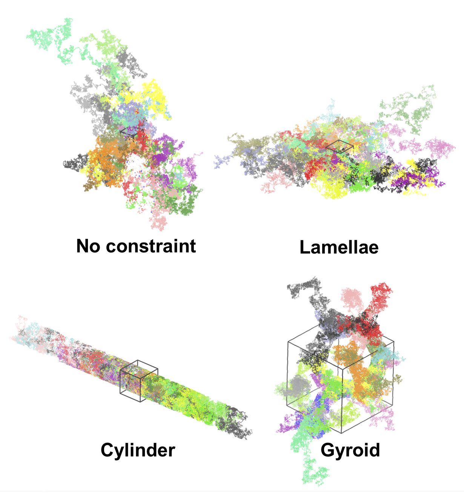

# Constrained-random-walk
Python script to generate unconfined or confined random walks (RW) in the presence of walls. The fundamental assumption is that when the RW would pass through a wall, it instead reflects off.

## Motivation
Block copolymers (BCPs) are widely used in transport applications, as their chemically distinct polymer components locally microphase separate into domains with different material properties. For battery electrolyte applications, ions dissolve in and diffuse through one microphase while the other provides mechanical robustness, potentially allowing for both ion conduction and the ability to block lithium dendrite growth at the same time. The BCP systems of interest are locally ordered with well-known microphases such as *hexagonally packed cylinders*, *lamellae*, and *gyroid* phases. However, on a longer length scale such as the width of a typical membrane, multiple grains with these structures are present, and these grains are often considered to be randomly oriented with respect to each other. Thus, it is difficult to predict which morphology is most transport-efficient, as shown in the figure below.

<p align="center">
	
</p>

**Over long enough time scales, a diffusing particle’s motion follows a random walk. Thus, we develope this python script to perform random walk confined by various BCP nanostructures and to predict particle diffusion in those structures.** Specifically, this script considers particles placed in the BCP conducting domain that move as random walks constrained by the surfaces of the domain (if any random walk step would to cross the surface, it instead is reflected). For now, it is also assumed that the box is a unit cube with appropriate periodic boundary conditions
(or equivalently, we only start in the unit cube, but the system expands into all space with the appropriate symmetry). Here's a demo of this script:

<p align="center">
	
</p>

## Usage

```
$ python2 crw.py [-h] [-n NTRIAL] [-p NPARTICLE] [-s NSTEP] [-l LBOX] [-c CONSTRAINT] [-i DUMPINTRVL] [-f FA] [-o]
```

*Python 2 is required. Scipy and numpy packages are also required*


## Input arguments of `crw.py`
The input flags/arguments of `crw` are summarized in the following table:

| Flag | Argument     | Type | Explanation       | Default       | 
| -----| --------------|:------:|-------------------|:-------------:|
| `-n` | `ntrial` | `int` | Number of trials | `100`|
| `-p` | `nparticle` | `int` | Number of particles in each trial (no collision)| `10` |
| `-s` | `nstep` | `int` | Number of steps for each paricle in each trial | `100000`|
| `-l` | `lbox` | `int` | Box dimension (cubic box) | `20`|
| `-c` | `constraint` | `str` | Constraint type (`none`, `lamellae`, `cylinder`, or `gyroid`)  | `none`|
| `-i` | `dumpintrvl` | `int` | Frequency of the MSD result output | `10000`|
| `-f` | `fA` | `float` | Volume fraction of conducting (A) domain (only matters for gyroid phase) | `0.35`|
| `-o` |  | | Output trajectory file (lammpstrj format for VMD) | `False`|

Note that for ```constraint```,
- ```none```: no constraint (no wall)
- ```lamellae```: assumes that the z=0 and z=L planes are walls
- ```cylinder```: assumes that the wall is a cylinder surface along z-dir with radius of L/2 centered at (L/2, L/2)
- ```gyroid```: assumes that the wall is the surface of a double gyroid unit cell


## Output
The script returns (prints out) the average and the standard deviation from each trial's mean square displacement of the random walk particle(s). Using the default input arguments, a representative output result is as follows:
```
   step      msd-avg      msd-std
      0       0.0000       0.0000
  10000    9700.4309    2388.6423
  20000   19580.0409    4009.1777
  30000   29664.9249    6137.1582
  40000   40341.2519    9551.9256
  50000   50183.5446   11981.6318
  60000   59875.0177   13894.7659
  70000   70194.5502   18346.1631
  80000   79615.8532   20184.9666
  90000   90235.7670   21381.2300
 100000   99438.5117   24490.8179
```

Finally, if the flag ```-o``` is used, the trajectory of every random walk will be created in the format of a LAMMPS trajectory file. This allows you to visualize the trajectory in VMD. Example images are shown below (different colors represent different trial/particle trajectories):

<p align="center">
	
</p>

## Reference in BibTeX [[link]](https://pubs.acs.org/doi/abs/10.1021/acsmacrolett.8b00506)
```
@article{shen2018diffusion,
  title={Diffusion in lamellae, cylinders, and double gyroid block copolymer nanostructures},
  author={Shen, Kuan-Hsuan and Brown, Jonathan R and Hall, Lisa M},
  journal={ACS Macro Letters},
  volume={7},
  number={9},
  pages={1092--1098},
  year={2018},
  publisher={ACS Publications}
}
```
